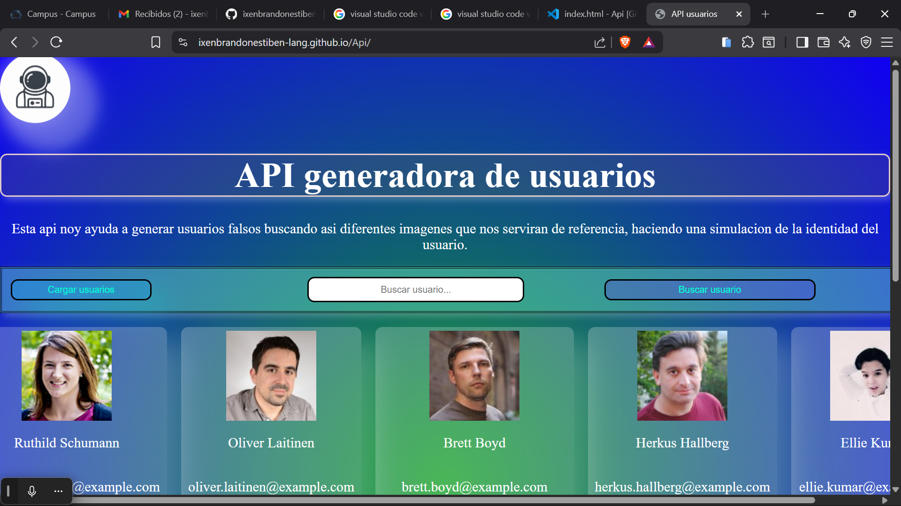
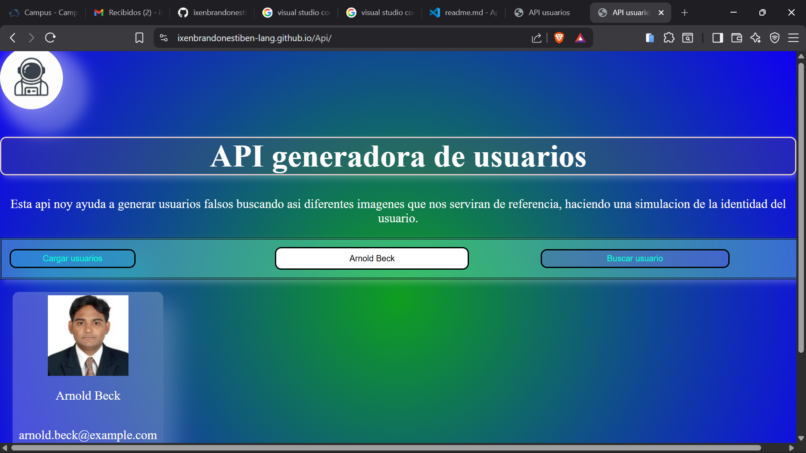

# API CREADORA DE USUARIOS

-------------------------

Citio web donde podemos generar usuarios falsos para poder simular las diferentes formas de manipular los datos de una cuenta en diferentes campos, como por ejemplo: usarlo en un banco para llevar un control de las personas nuevas que se registren dia con dia, la API utilizada se basa en generar usuarios falsos.

# API 
------------------------------------
## --Descripcion:-- Api para generar usuarios falsos.
## --link de la api:-- https://randomuser.me/api/

------------------------------------

# Precentacion de la app

------------------------------------

------------------------------------

# Como hacerlo funcionar

    1.primero habrir visual studio code

    2.Abrir el index.html

    3.Hacer click derecho

    4.Ir al apartado de habrir con live server...

    5.O darle click a este enlace :

    6.Luego de entrar a la pagina precionar el boton cargar usuarios.

# Herramientas de apollo.

    - HTML
    - CSS
    - JAVASCRIPT
    - GOOGLE
    - GITHUB
    - VISUAL STUDIO CODE

# Autor

Brandon Estiben Ixen Teleguario
ixenbrandonestiben@gmail.com